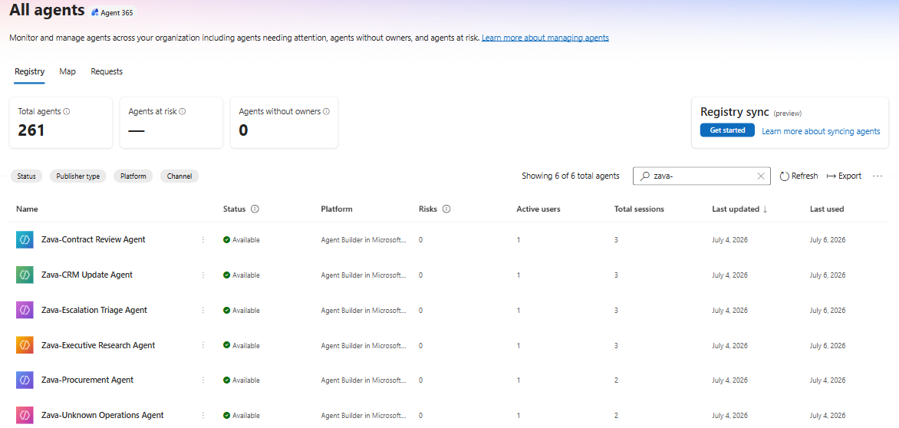

# Exercise 01: Discover the Zava Agentic AI Estate

## Introduction

You'll open the Agent365 registry, search for Zava's agents, and review their status, risk, and usage metrics.

## Description

This exercise establishes a baseline inventory of Zava's AI agents and identifies which agents warrant deeper governance review based on usage patterns.

## Success criteria

- You confirmed all six Zava agents appear in the registry with status **Available**.
- You identified that four agents show 3 total sessions, while Procurement and Unknown Operations show 2 total sessions.
- You identified that all six agents have at least one active user.
- You flagged agents requiring deeper review based on usage, ownership, and permissions.

## Key tasks

### 01: Discover the Zava agentic estate

1. From the Microsoft 365 Admin center, select **Agents** in the left navigation menu, then **All agents**.

1. In the search box, above the agent list, type ++zava-++ and press **Enter**. Take note of the **Status**, **Platform**, **Risks**, **Active users**, **Total sessions**, and **Last updated** columns for each agent.

	

1. Compare the live usage metrics: four agents show three total sessions, while Procurement and Unknown Operations show two total sessions.

1. Note the agents Unknown Operations, Procurement, Contract Review, CRM Update, Executive Research, and Escalation Triage as candidates for deeper review based on ownership, permissions, sensitivity, or lifecycle context.