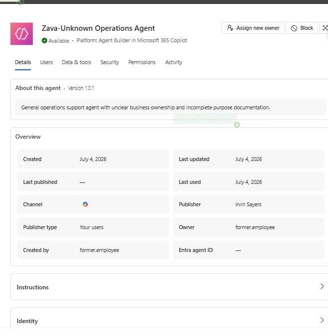
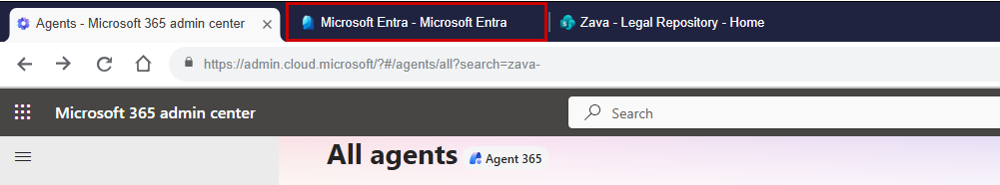
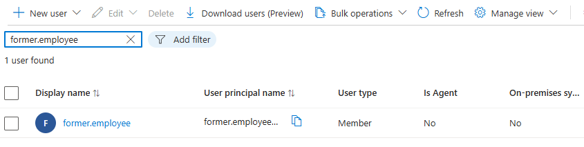
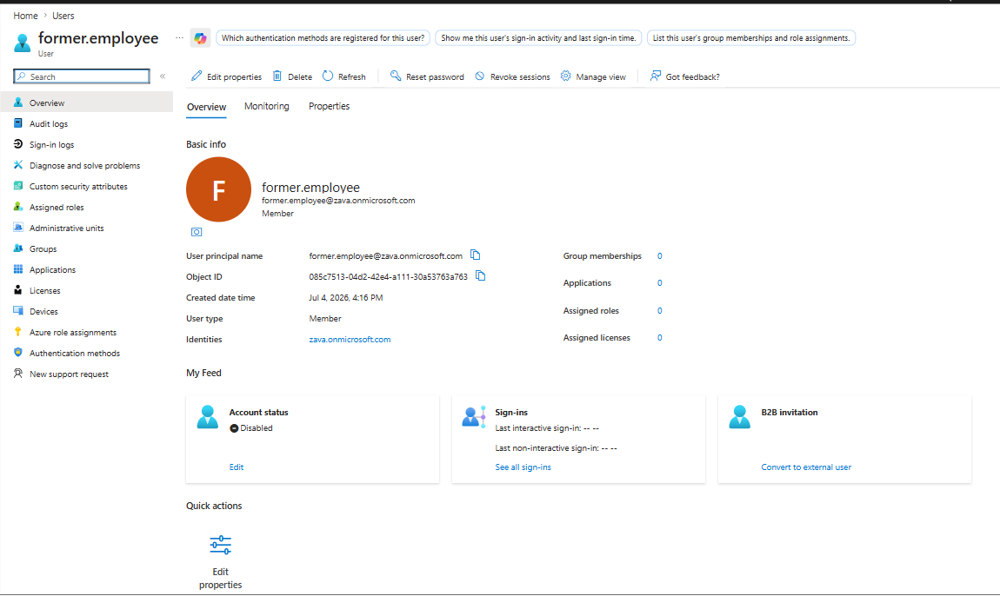
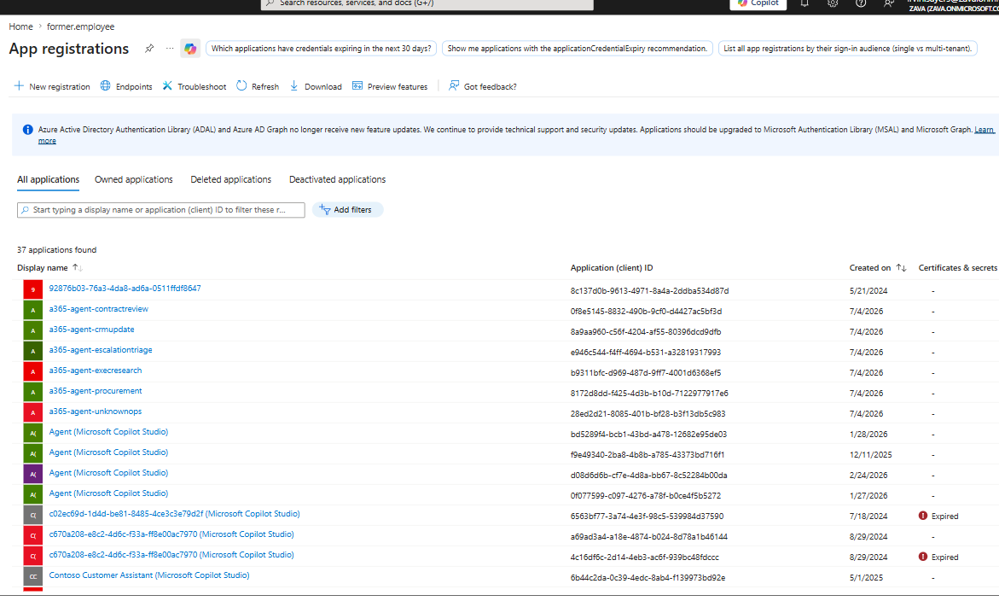
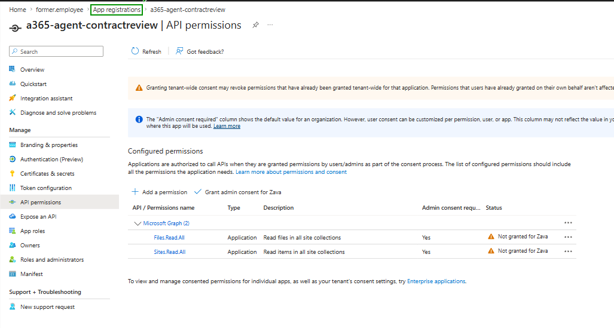

# Exercise 02: Investigate Ownership, Identity, and Permissions

## Introduction

You'll inspect the Unknown Operations agent's ownership in Agent365, cross-check the owner account in Entra, and review Microsoft Graph permissions on three agent app registrations.

## Description

This exercise verifies whether Zava's agents have valid, accountable ownership and whether their associated identities hold excessive permissions relative to their business purpose.

## Success criteria

- You confirmed Zava-Unknown Operations Agent has invalid ownership (owner and creator are a blocked former-employee account).
- You confirmed Contract Review Agent has broad file/site permission evidence.
- You confirmed CRM Update Agent has broad user/group/mail permission evidence.
- You confirmed Executive Research Agent has broad file/site permission evidence.

## Key tasks

### 01: Inspect Unknown Operations ownership

1. From the agents list, open the **Zava-Unknown Operations Agent**.

1. Review the **Owner** and **Created by** fields. You'll notice both should show `former.employee`.

	

1. From the browser tab bar, select **Microsoft Entra - Microsoft Entra**.

	

1. From the left navigation menu, go to **Users**.

1. In the **Search users** box, type ++former.employee++, and press **Enter**.

1. Select the **former.employee** account from the results.

	

1. Confirm the account is blocked / sign-in disabled.

	

### 02: Review associated app permission evidence

1. From the Entra navigation menu, select **App registrations** and select the **All applications** tab.

	

1. Open `a365-agent-contractreview` and, from its left side menu, select **API permissions**

1. You should see these permissions: (Sites.Read.All, Files.Read.All). Broad site and file read permissions should be reviewed against the contract review use case.

1. Return to the **App registrations** list by selecting it in the breadcrumbs menu.

	

1. From the existing list of apps, select `a365-agent-crmupdate` and then select its **API permissions**.

1. Make sure you have these permissions: (User.Read.All, Group.Read.All, Mail.Read). Broad user, group, and mail permissions should be reviewed against the CRM update use case.

1. Return to the **App registrations** list by selecting it in the breadcrumbs menu.

1. From the existing list of apps, select `a365-agent-execresearch` and review its API permissions (Sites.Read.All, Files.Read.All). Broad site and file read permissions increase impact for executive strategy content.

1. Return to the **App registrations** list by selecting it in the breadcrumbs menu.

1. Confirm the remaining app registrations exist in the list:

    - `a365-agent-escalationtriage`,
    - `a365-agent-procurement`, and
    - `a365-agent-unknownops`.

	No need to select them.