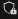
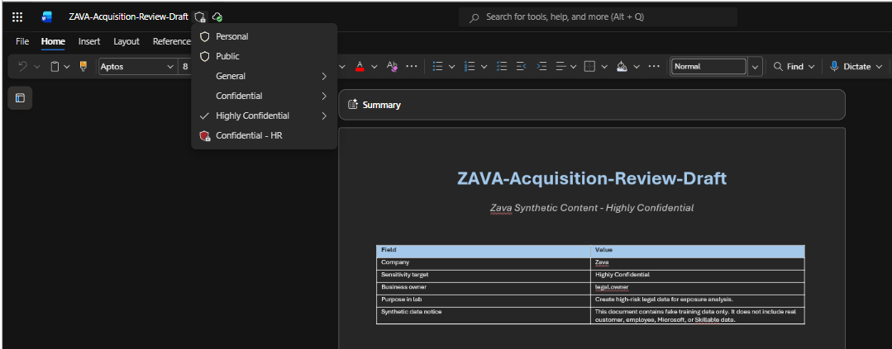
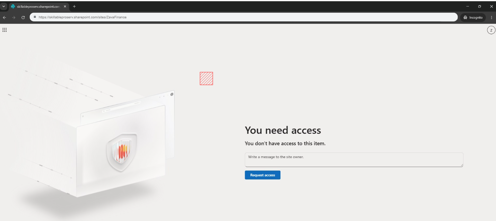

# Exercise 03: Investigate Sensitive Data Exposure

## Introduction

You'll review sensitivity labels on key SharePoint repositories, inspect Customer Records site permissions, and validate access as a low-privileged reader account.

## Description

This exercise determines whether Zava's sensitive data repositories are appropriately protected and whether any repository is overexposed relative to its sensitivity.

## Success criteria

- You confirmed Legal, Executive Strategy, and Finance contain Highly Confidential content.
- You confirmed Customer Records contains Confidential customer escalation data.
- You confirmed the A365 Lab Student Readers group has Read access to Customer Records.
- You confirmed the low-privileged reader can access Customer Records but is denied on Finance and Legal.
- You concluded Customer Records is overexposed compared with the other sensitive repositories.

## Key tasks

### 01: Review sensitive repositories

Sample files and their expected sensitivity label:

1. From the browser tab bar, select the **Zava - Legal Repository - Home** Sharepoint tab.

1. From the left navigation menu, select **Documents**, then **Contracts**.

1. From the available files, select the first document: **ZAVA-Acquisition-Review-Draft.docx**.

1. Select the label shield , on the upper left, next to the document title on the top bar, and check that the security label is **highly Confidential**.

	

1. You can close the **ZAVA-Acquisition-Review-Draft.docx** document tab.

1. From the browser tab bar, select the new tab button  and it will open the **Zava - Executive Strategy** sharepoint site.

1. From the left side menu, select **Documents**, then **Board Materials**.

1. From the documents list, open **ZAVA-Board-Readout-Q3.docx**.

1. Just like for Step 4, select the label shield , on the upper left, and check that the security label is **highly Confidential**.

1. Close the Word tab.

1. From the browser tab bar, select the new tab button  and it will open the **Zava - Customer Records** sharepoint site.

1. Select **Documents**, then **Escalations**, and then open **ZAVA-Customer-Escalation-Northwind.docx**.

1. Check the document's label and make sure it's **Confidential**. When done, close the tab.

1. Open each site listed above and confirm the sample file's sensitivity label and content match what's expected.

| Site | Path / sample file | Expected label / content |
|---|---|---|
| Zava - Legal Repository | Documents > Contracts > ZAVA-NDA-Contoso.docx | Highly Confidential legal content |
| Zava - Executive Strategy | Documents > Board Materials > ZAVA-AI-Strategy-Roadmap.docx | Highly Confidential executive strategy content |
| Zava - Customer Records | Documents > Escalations > ZAVA-Customer-Escalation-Northwind.docx | Confidential customer escalation content |
| Zava - Finance | Documents > Forecasts > ZAVA-FY27-Budget-Forecast.xlsx | Highly Confidential finance content |
| Zava - Procurement | Documents > Vendors | Confidential procurement/vendor content |

---

### 02: Show Customer Records permissions

1. Back on the **Zava - Customer Records** Sharepoint site, select the **Settings** icon 

1. Select **Site permissions**, then select **Advanced permissions settings**.

1. Confirm the **A365 Lab Student Readers** group has **Read** access.

1. Note that a non-admin access test is needed next to prove the exposure isn't caused by your account's admin rights.

1. Close the browser tab.

---

### 03: Validate access as the low-privileged reader

1. From the browser tab bar, right-click anywhere, and on the context menu, select **New InPrivate window**

1. On the Incognito browser address bar, paste ++https://zava.sharepoint.com/sites/ZavaCustomerRecords++, press **Enter** and confirm access succeeds.

1. In the address bar, go to the Zava Finance Sharepoint: ++https://zava.sharepoint.com/sites/ZavaFinance++ and press Enter and confirm access is denied.

	

1. In the address bar, go to the Zava Legal Repository Sharepoint ++https://zava.sharepoint.com/sites/ZavaLegalRepository++ and confirm access is denied.

1. Close the InPrivate window when finished.